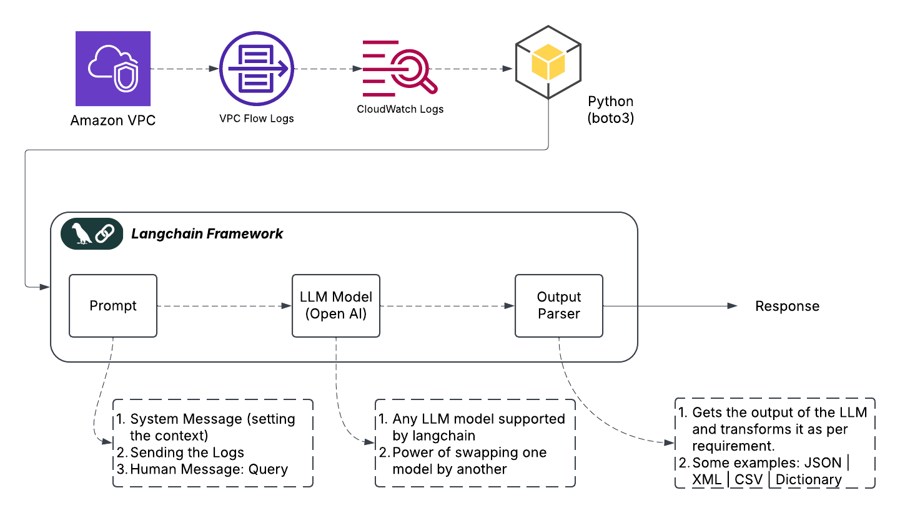

# AWS VPC Flow Log Querying with LangChain and OpenAI

This repository demonstrates how to analyze AWS VPC Flow Logs using LangChain and OpenAI's GPT-4.0 model to process user queries. The logs are fetched from AWS CloudWatch, and user queries are processed through a language model to extract meaningful network flow information.

## Overview

This solution automates the process of analyzing AWS VPC Flow Logs by integrating the AWS CloudWatch service with LangChain and OpenAI's GPT model. The process involves fetching VPC logs, transforming them for easy analysis, and then using GPT-4 to answer user queries based on those logs. By leveraging the power of AI, users can quickly identify network flow patterns, troubleshoot issues, and gain security insights without manually sifting through raw logs.




The solution follows these steps:
1. Fetching VPC Flow Logs from AWS CloudWatch.
2. Converting timestamps and log data into a human-readable format.
3. Processing natural language queries to extract relevant network flow details.
4. Returning structured responses based on the logs and queries.


## Prerequisites

Before using this solution, ensure the following:

- **Python 3.10 or higher**: Make sure Python is installed on your system. [Download Python](https://www.python.org/downloads/)
- **Poetry**: A dependency management tool for Python. [Install Poetry](https://python-poetry.org/docs/#installation)
- **AWS CLI**: Install AWS CLI and configure your credentials. Follow the [AWS CLI setup guide](https://docs.aws.amazon.com/cli/latest/userguide/getting-started-install.html).
- **OpenAI API Key**: You'll need an OpenAI API key for GPT model integration. You can get your API key from [OpenAI's API documentation](https://beta.openai.com/signup/).

Once you've set up the necessary tools, you're ready to proceed with installing dependencies and configuring your environment.


## Installation

To set up this project, follow these steps:

1. **Ensure Poetry is Installed**:
   Install Poetry if you haven't already. Run the following command:
   ```bash
   curl -sSL https://install.python-poetry.org | python3 -
   poetry --version  # Verify installation
   ```

2. **Install Dependencies**:
   Initialize the Poetry environment and install the dependencies:
   ```bash
   poetry install
   ```

3. **Activate the Virtual Environment**:
   To activate the environment, run:
   ```bash
   poetry shell
   ```

4. **Verify Installed Dependencies**:
   You can check if the dependencies are correctly installed by running:
   ```bash
   poetry show
   ```

Optional: If you prefer using `pip` instead of Poetry, you can manually install dependencies listed in `pyproject.toml`.


## Environment Setup

You need to configure the following environment variables for the application to run properly:

1. **Install AWS CLI & Ensure Keys are Configured**:
   Follow the instructions in the [AWS CLI User Guide](https://docs.aws.amazon.com/cli/latest/userguide/getting-started.html) to install the AWS CLI and set up your access keys.

2. **Create a `.env` File**:
   Create a `.env` file in the root directory of this project and add the following environment variables:
   
   ```bash
   OPENAI_API_KEY=your-openai-api-key
   LOG_GROUP_NAME=<your-log-group-name>
   REGION_NAME=us-east-2
   ```
   Replace the placeholders with your actual values:
   - `OPENAI_API_KEY`: Your OpenAI API key.
   - `LOG_GROUP_NAME`: The name of your AWS CloudWatch log group containing the VPC Flow Logs.
   - `REGION_NAME`: The AWS region where your CloudWatch logs are stored.

   **Note**: Do not commit your `.env` file to version control (e.g., Git). Add it to `.gitignore` to keep sensitive information secure.

## Running the Script

Once everything is set up and your environment variables are configured, you can run the script with the following command:

```bash
python your_script.py
```

The script will:

1. Fetch VPC Flow Logs from AWS CloudWatch.
2. Process the logs and convert timestamps.
3. Answer the provided queries based on the logs.
4. Feel free to modify the user_queries list in the script to ask different questions.

More details can be fuond in this blog post. 
[Using LangChain to Chat with AWS VPC Flow Logs](https://jamali.hashnode.dev/using-langchain-to-chat-with-aws-vpc-flow-logs)


Example Query:
Show the connections with Protocol equals 6 and Destination Port equals 22.

Response:
timestamp: 2025-02-24 13:45:30 Source IP: 192.168.1.1 Destination IP: 10.0.0.1 Source Port: 1024 Destination Port: 22 Protocol: 6 Action: ACCEPT


